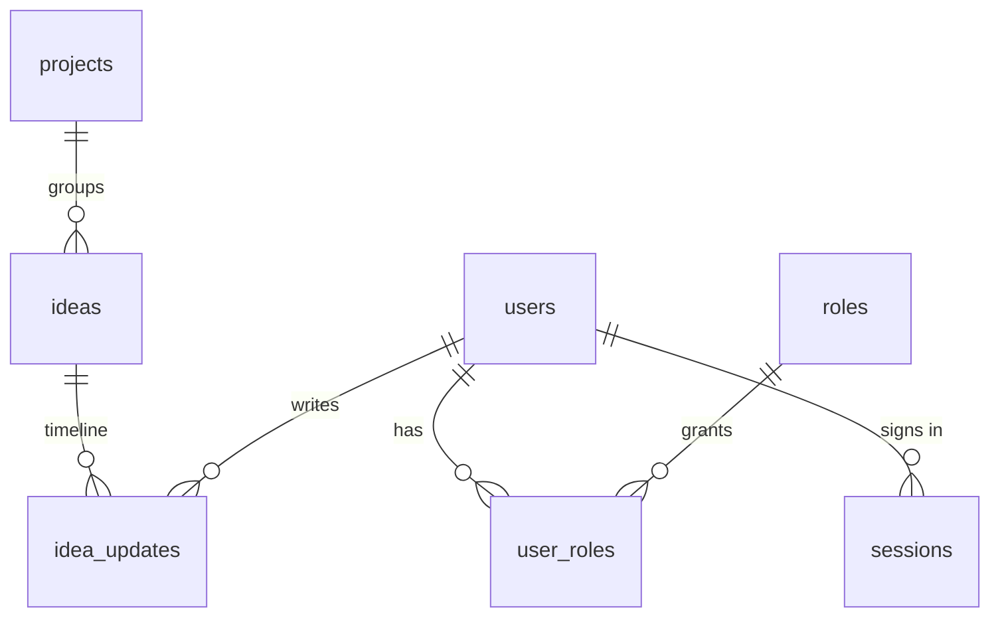

# Database

MySQL on Hostinger, database `u962314563_devquake`. The app connects with the environment
variables below. Credentials are **never** committed; production values live in hPanel.

| Variable       | Required | Default     | Notes                                          |
| -------------- | -------- | ----------- | ---------------------------------------------- |
| `MAIN_DB_NAME` | yes      | —           | `u962314563_devquake`                          |
| `MAIN_DB_USER` | yes      | —           | database user                                  |
| `MAIN_DB_PWD`  | yes      | —           | database password                              |
| `MAIN_DB_HOST` | no       | `localhost` | Remote MySQL host when connecting from your PC |
| `MAIN_DB_PORT` | no       | `3306`      |                                                |

Compatible with MySQL 8.0+ and MariaDB 10.6+. All `DATETIME` values are **UTC**.

## Tables

| Migration                         | Tables                                                                            |
| --------------------------------- | --------------------------------------------------------------------------------- |
| `0001_users_and_auth.sql`         | `schema_migrations`, `users`, `roles`, `user_roles`, `sessions`, `login_attempts` |
| `0002_projects_and_ideas.sql`     | `projects`, `ideas`, `idea_updates`                                               |
| `0003_activity_log.sql`           | `activity_log`                                                                    |
| `0004_seed_roles_and_roadmap.sql` | seed: roles, roadmap projects and ideas                                           |



- **users / roles / user_roles** — one account for the host and every plugin. Roles have a
  `scope`: `platform` or a plugin id (for example `bills.admin`). `/admin-cp` requires
  `platform.admin`.
- **sessions** — server-side sessions. The cookie holds a random token; only its SHA-256 is
  stored. 12 h absolute lifetime, 2 h idle timeout, revocable.
- **login_attempts** — feeds brute-force throttling (5 failures per email or 20 per IP in
  15 minutes) and account lockout (15 minutes).
- **projects / ideas / idea_updates** — ideas with status, priority, progress 0–100 and target
  date; every status/progress change or note is appended to `idea_updates`.
- **activity_log** — site-wide log. `source` is `host`, `admin-cp` or a plugin id; `level`
  `security` marks auth events. No FK on the actor so rows survive user deletion.

## Setting up the database (first time)

### Option A: phpMyAdmin (no remote access needed)

1. hPanel → **Databases** → **phpMyAdmin** → open `u962314563_devquake`.
2. **Import** each file of `db/migrations/` in order (`0001` … `0004`).
3. Create your admin account locally and paste the printed SQL into phpMyAdmin → **SQL**:
   ```powershell
   pnpm admin:create
   ```
   The script asks for email, name and password (min. 12 characters) and prints SQL that contains
   only a one-way scrypt hash, never the password.

### Option B: from your machine

1. hPanel → **Databases** → **Remote MySQL**: allow your IP for the database, note the host name.
2. Put `MAIN_DB_*` (with `MAIN_DB_HOST` = that host) in `apps/host/.env.local`.
3. `pnpm db:migrate` (or `pnpm db:migrate --status`), then `pnpm admin:create --apply`.

Remove your IP from Remote MySQL when you are done.

## Signing in

Open `https://devquake.com/admin-cp` (locally `http://localhost:3000/admin-cp`). The panel is not
linked anywhere, sends `noindex`, and is only served on the root domain. Resetting a forgotten
password: run `pnpm admin:create` again with the same email; it replaces the hash, unlocks the
account and signs out all its sessions.

## Adding a migration

Create `db/migrations/NNNN_description.sql` with the next number. Make it re-runnable
(`CREATE TABLE IF NOT EXISTS`, `INSERT IGNORE`), end it with
`INSERT IGNORE INTO schema_migrations (version) VALUES ('NNNN_description');`, and never edit a
migration that has been applied to production — add a new one instead.

## Retention

Not automated yet. Suggested periodic clean-up (see the end of `0003_activity_log.sql`): activity
older than 180 days (except `security`), login attempts older than 90 days, expired sessions.
