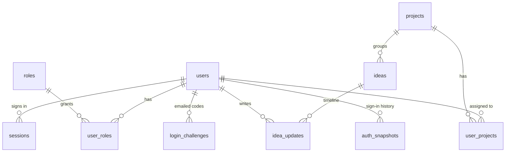

# Database

MySQL on Hostinger, database `u962314563_devquake`. The app connects with the environment
variables below. Credentials are **never** committed; production values live in hPanel.

| Variable       | Required | Default     | Notes                                          |
| -------------- | -------- | ----------- | ---------------------------------------------- |
| `MAIN_DB_NAME` | yes      | —           | `u962314563_devquake`                          |
| `MAIN_DB_USER` | yes      | —           | database user                                  |
| `MAIN_DB_PWD`  | yes      | —           | database password                              |
| `MAIN_DB_HOST` | no       | `localhost` | Remote MySQL host when connecting from your PC |
| `MAIN_DB_PORT` | no       | `3306`      |                                                |

Compatible with MySQL 8.0+ and MariaDB 10.6+. All `DATETIME` values are **UTC**.

## Tables

| Migration                             | Tables                                                                                                                       |
| ------------------------------------- | ---------------------------------------------------------------------------------------------------------------------------- |
| `0001_users_and_auth.sql`             | `schema_migrations`, `users`, `roles`, `user_roles`, `sessions`, `login_attempts`                                            |
| `0002_projects_and_ideas.sql`         | `projects`, `ideas`, `idea_updates`                                                                                          |
| `0003_activity_log.sql`               | `activity_log`                                                                                                               |
| `0004_seed_roles_and_roadmap.sql`     | seed: roles, roadmap projects and ideas                                                                                      |
| `0005_user_accounts.sql`              | `user_projects`, `auth_snapshots`, `login_challenges`, `email_outbox`; owner role; `users.rating`, `users.email_verified_at` |
| `0006_contact_messages.sql`           | `contact_messages` (landing-page contact form)                                                                               |
| `0007_public_projects_and_visits.sql` | `projects.is_online`, public project descriptions, `visit_salts`, `site_visitors_daily`, `site_stats_daily`                  |
| `0008_visibility.sql`                 | `projects.is_public`, `ideas.is_public` (existing rows public, new rows private)                                             |
| `0009_account_activation.sql`         | `account_activations` (sign-up activation links), `auth_snapshots.event` += `activate`                                       |
| `0010_project_subscriptions.sql`      | `project_subscriptions` (who may use which app)                                                                              |
| `0011_referrals_avatars.sql`          | `users.referral_code` / `nps` / `referred_by`, `referral_invites`, `user_avatars`                                            |
| `0012_project_feedback.sql`           | `project_feedback`: likes and quality/usefulness ratings (1–5) per user and project                                          |



- **users / roles / user_roles** — one account for the host and every plugin (public sign-up on
  the landing page). Roles have a `scope`: `platform` or a plugin id (for example `bills.admin`).
  `platform.owner` sees everything in `/admin-cp`; `platform.admin` (the "Admin" checkbox the
  owner ticks) may use `/admin-cp` without users, statistics or the activity log;
  `platform.user` is every signed-up account. `rating` (1–5) is internal to the owner.
- **user_projects** — which projects/plugins a user is assigned to, as viewer/member/manager.
- **sessions** — server-side sessions. The cookie holds a random token; only its SHA-256 is
  stored. 12 h absolute lifetime, 2 h idle timeout, revocable.
- **login_challenges** — the emailed 6-digit code for every sign-in and sign-up. Only
  `SHA-256(browser token + code)` is stored; the token lives in an HttpOnly cookie. 10 minutes,
  5 tries, 3 re-sends (60 s apart), single use.
- **login_attempts** — every password step; 3 consecutive failures lock the email for 3 hours,
  20 failures per IP in 15 minutes are throttled.
- **auth_snapshots** — one row per sign-up / sign-in / code step: time, IP, location, ISP,
  VPN/proxy flag and operator, browser, OS, device, browser time zone/language/screen, and a
  time-zone mismatch hint. Feeds the owner's statistics page. MAC addresses cannot be collected
  by any website (they never leave the visitor's local network).
- **project_subscriptions** — projects a user subscribed to from the landing page or `/account`
  (the owner can also manage them in `/admin-cp/users/<id>`; changes are emailed to the user).
  An online app opens for its subscribers, users assigned in `user_projects`, and admins
  (ADR 0006).
- **referral_invites / users.nps** — invitations by email and sign-ups through a member's link
  (`/r/<code>`). Status `sent` → `signed_up` → `joined`; the inviter's `nps` goes up by one when
  the invited account is **activated**. Unanswered invites are deleted after 90 days.
- **user_avatars** — profile pictures (256×256, resized in the browser), stored in the database
  because app files are replaced on every deploy. Visible only to the user and admins.
- **Account deletion** (`/account` → Delete account, `src/lib/account-deletion.ts`) removes the
  user row (cascading to everything linked) and their personal data in tables without a foreign
  key. Add any new table holding personal data there as well.
- **account_activations** — the link in the welcome email after sign-up. The account stays
  `pending` (cannot sign in) until the link is opened. Only SHA-256 of the token is stored; a
  link works once and expires after 48 hours. Signing in to a pending account sends a new link.
- **email_outbox** — every email sent (template, status, error). Bodies are not stored.
- **contact_messages** — contact-form messages (also emailed to contact@devquake.com with
  Reply-To set to the sender). Owner reads them in `/admin-cp/messages`. Spam protection: a
  honeypot field, a minimum fill time and 3 messages per IP per hour.
- **projects.is_public / ideas.is_public** — public items appear on the landing page, its
  statistics and the sitemap; private items only in `/admin-cp`. New items start private. A
  public idea is only shown if its project is public too; idea descriptions and notes are never
  published.
- **projects.is_online** — set in `/admin-cp/projects/<id>`; an app on its subdomain is only
  served (and linked from the landing page) while its project is online **and public**.
- **visit_salts / site_visitors_daily / site_stats_daily** — cookie-free visitor counting for the
  landing page statistics: visitor = SHA-256(daily salt + IP + user agent); the salt and the
  day's hashes are deleted when the next day starts, only daily totals remain.
- **projects / ideas / idea_updates** — ideas with status, priority, progress 0–100 and target
  date; every status/progress change or note is appended to `idea_updates`.
- **activity_log** — site-wide log. `source` is `host`, `admin-cp` or a plugin id; `level`
  `security` marks auth events. No FK on the actor so rows survive user deletion.

## Setting up the database (first time)

### Option A: phpMyAdmin (no remote access needed)

1. hPanel → **Databases** → **phpMyAdmin** → open `u962314563_devquake`.
2. **Import** each file of `db/migrations/` in order (`0001` … `0012`). Import only the ones you have not
   imported yet; `0005` also makes every existing admin the owner.
3. Create your admin account locally and paste the printed SQL into phpMyAdmin → **SQL**:
   ```powershell
   pnpm admin:create
   ```
   The script asks for email, name and password (min. 12 characters) and prints SQL that contains
   only a one-way scrypt hash, never the password. It creates the **owner** account. Everyone
   else signs up on the landing page; the owner then grants roles in `/admin-cp/users`.

### Option B: from your machine

1. hPanel → **Databases** → **Remote MySQL**: allow your IP for the database, note the host name.
2. Put `MAIN_DB_*` (with `MAIN_DB_HOST` = that host) in `apps/host/.env.local`.
3. `pnpm db:migrate` (or `pnpm db:migrate --status`), then `pnpm admin:create --apply`.

Remove your IP from Remote MySQL when you are done.

## App databases (ADR 0007)

Apps that declare `database: true` (currently `shopping`) have their **own** database; the
platform never reads their tables. For each app:

1. hPanel → **Databases** → create a database and user, e.g. `u962314563_shopping`.
2. hPanel → website → **Environment variables**: `SHOPPING_DB_NAME`, `SHOPPING_DB_USER`,
   `SHOPPING_DB_PWD` (the prefix is the app id in upper case, `-` → `_`).
3. Apply its schema: phpMyAdmin → select that database → **Import** each file of
   `plugins/<id>/db/migrations/`, or from your machine `pnpm db:migrate --plugin <id>`.

Without these variables the app shows "not available right now" and its admin stats are empty.

## Signing in

Every sign-in (site and control panel) is email + password, then a one-time code sent by email,
so **SMTP must be configured** (`SMTP_USER`, `SMTP_PWD`; see `apps/host/.env.example`). In local
development without SMTP the code is printed in the terminal running `pnpm dev`.

Open `https://devquake.com/admin-cp` (locally `http://localhost:3000/admin-cp`). The panel is not
linked anywhere, sends `noindex`, and is only served on the root domain. Resetting a forgotten
password: run `pnpm admin:create` again with the same email; it replaces the hash, unlocks the
account and signs out all its sessions.

## Adding a migration

Create `db/migrations/NNNN_description.sql` with the next number and end it with
`INSERT IGNORE INTO schema_migrations (version) VALUES ('NNNN_description');`.

Every migration must be **safe to import twice** (phpMyAdmin stops at the first error, so a
half-imported file is common):

- `CREATE TABLE IF NOT EXISTS`, `INSERT IGNORE`, and `UPDATE`s with a `WHERE` that makes them
  harmless when repeated.
- MySQL has no `ADD COLUMN IF NOT EXISTS`, so guard each `ALTER TABLE` via `information_schema`:

  ```sql
  SET @dq_sql := IF(
    (SELECT COUNT(*) FROM information_schema.COLUMNS
      WHERE TABLE_SCHEMA = DATABASE() AND TABLE_NAME = 'projects' AND COLUMN_NAME = 'new_col') = 0,
    'ALTER TABLE projects ADD COLUMN new_col INT NULL',
    'DO 0');
  PREPARE dq_stmt FROM @dq_sql;
  EXECUTE dq_stmt;
  DEALLOCATE PREPARE dq_stmt;
  ```

- One-time data changes (backfills, role promotions) must only run until the migration is
  recorded, so a re-import never overwrites later changes:
  `SET @done := (SELECT COUNT(*) FROM schema_migrations WHERE version = 'NNNN_description');`
  and add `AND @done = 0` to the statement (see `0005` and `0008`).

## Retention

Automatic: `apps/host/src/lib/retention.ts` deletes old rows at most once a day per server
process (triggered by sign-ins and contact messages; managed hosting has no cron). The periods
in `RETENTION_DAYS` are also what the privacy policy (`/privacy`) promises, so change them there
only.

Users' **sign-in activity** (`auth_snapshots`) and **account activity** (the activity-log actions
in `lib/account-events.ts`, plus the owner's `user.updated` changes to an account) are deleted
after **90 days**; the account page and the admin user page show a note saying so.

Inactive **accounts** are not removed automatically: in `/admin-cp/users` the owner filters by
"Never signed in" or "No sign-in for 6+ / 12+ months", ticks the accounts and uses **Delete
selected** (type DELETE). Each one is deleted completely, including its data in the apps, and
the person gets an email. Other
activity-log entries (admin work, app errors) keep their own, longer periods.
