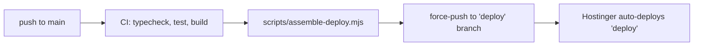

# Deployment

## Hosting provider

| Item               | Value                                |
| ------------------ | ------------------------------------ |
| Provider           | Hostinger                            |
| Control panel      | hPanel                               |
| Domains management | https://hpanel.hostinger.com/domains |
| Domain             | `devquake.com`                       |

DNS records, subdomains, SSL certificates and the hosting plan for `devquake.com` are all managed
in hPanel. Credentials are never stored in this repository; ask the account owner for access.

## Hostinger managed Node.js (Business / Cloud plans) — current setup

Hostinger builds Node.js apps with npm, which cannot install our pnpm workspace. So the build
happens in GitHub Actions and Hostinger only runs the result:



The `deploy` branch contains only `server.js`, a minimal `package.json` (next, react, react-dom)
and the compiled app. Never edit it by hand; it is overwritten on every push to `main`.

### One-time setup in hPanel

1. Push `main` to GitHub and wait for the **CI** workflow to go green (Actions tab). The
   `deploy` branch now exists.
2. If `devquake.com` already has a website on the plan (e.g. a default PHP site), Hostinger
   requires removing it before a Node.js app can use the domain. Back it up first if it has
   anything you need.
3. hPanel → **Websites** → **Add Website** → **Deploy Web App** → **Import Git Repository**,
   authorise GitHub, pick the repository.
4. Build settings:
   | Setting          | Value                                              |
   | ---------------- | -------------------------------------------------- |
   | Branch           | `deploy`                                           |
   | Framework        | **Other** (not Next.js — the app is already built) |
   | Node.js version  | 22.x                                               |
   | Build command    | `npm run build` (a no-op) or none                  |
   | Output directory | `.` (repo root) if asked                           |
   | Entry file       | `server.js`                                        |
5. **Environment variables**: `ROOT_DOMAIN=devquake.com`, plus the database:
   `MAIN_DB_NAME`, `MAIN_DB_USER`, `MAIN_DB_PWD` (and `MAIN_DB_HOST` only if the database is
   not on `localhost`). See [db/README.md](../../db/README.md) for the schema and for creating
   the owner account used at `https://devquake.com/admin-cp`.
   Email (required: every sign-in sends a code): `SMTP_USER` (e.g. `contact@devquake.com`) and
   `SMTP_PWD`; optional `SMTP_HOST` / `SMTP_PORT` (default `smtp.hostinger.com:465`) and
   `MAIL_FROM`. Optional `PROXYCHECK_API_KEY` for IP location / VPN detection above the free
   100 lookups per day.
   Optional `CRON_SECRET` (a long random string) turns on `GET /api/scheduled` with the header
   `Authorization: Bearer <CRON_SECRET>`, for an external cron (e.g. hourly) that runs the
   apps' scheduled work such as monthly emails (ADR 0014). Without it, that work runs from
   site traffic, at most once an hour.
6. Deploy and open https://devquake.com. Check **Deployments** → build log if it fails.

From then on: merge to `main` → CI → `deploy` branch → Hostinger redeploys automatically.

### Troubleshooting

**`Cannot find module .../corepack/.../pnpm.cjs` / "Failed to install dependencies"** — Hostinger
is building the `main` branch (the pnpm workspace) instead of `deploy`. Make sure the CI run on
`main` is green and the `deploy` branch exists on GitHub, then set the branch to `deploy` and
framework to **Other** in hPanel (website dashboard → Settings & Redeploy, or ⋮ → Change
repository) and redeploy.

### App subdomains on Hostinger (managed Node.js)

Each app is served on `<id>.devquake.com` by the **same** code. On Hostinger's managed Node.js
hosting only `devquake.com` is connected to the app, so every app subdomain needs these steps
once (verified with `shopping.devquake.com`):

1. **Subdomain**: hPanel → Domains → Subdomains → create `<id>` with the default folder
   (`public_html/<id>`, leave "Custom folder" unchecked).
2. **DNS**: if the domain's DNS is not managed by Hostinger (hPanel says it points "outside
   Hostinger"), add `CNAME <id> → devquake.com` where the DNS is managed (DNS only, no proxy).
3. **SSL**: hPanel → Security → SSL → install the free certificate for `<id>.devquake.com`.
4. **Connect it to the app**: in File Manager empty `public_html/<id>/` (Hostinger's default
   page would otherwise be served) and create `public_html/<id>/.htaccess` with the Passenger
   lines of `public_html/.htaccess` plus one line pointing to the shared settings file:

   ```apache
   PassengerAppRoot /home/u962314563/domains/devquake.com/hbuilds/current/nodejs
   PassengerAppType node
   PassengerNodejs /opt/alt/alt-nodejs22/root/bin/node
   PassengerStartupFile server.js
   PassengerBaseURI /
   PassengerRestartDir /home/u962314563/domains/devquake.com/hbuilds/current/nodejs/tmp
   SetEnv NODE_OPTIONS "--require /home/u962314563/domains/devquake.com/hbuilds/config/preload-timestamp.js"
   SetEnv LSNODE_CONSOLE_LOG console.log
   SetEnv TOKIO_WORKER_THREADS 2
   SetEnv DEVQUAKE_ENV_FILE /home/u962314563/domains/devquake.com/devquake.env
   ```

5. **Shared settings file** (once for all apps): the subdomain starts its own copy of the app and
   Hostinger does **not** give it the website's environment variables. Without them it does not
   know `ROOT_DOMAIN` (it shows the main site with `canonical: http://localhost:3000`) and cannot
   reach the database (visitors look signed out). Create
   `/home/u962314563/domains/devquake.com/devquake.env` (outside `public_html`, so it is never
   served) with the same values as hPanel → Environment variables, one `KEY=VALUE` per line:

   ```ini
   ROOT_DOMAIN=devquake.com
   MAIN_DB_NAME=...
   MAIN_DB_USER=...
   MAIN_DB_PWD=...
   SMTP_USER=...
   SMTP_PWD=...
   SHOPPING_DB_NAME=...
   SHOPPING_DB_USER=...
   SHOPPING_DB_PWD=...
   WORKOUT_DB_NAME=...
   WORKOUT_DB_USER=...
   WORKOUT_DB_PWD=...
   # and any optional ones you set: MAIN_DB_HOST/PORT, MAIL_FROM, PROXYCHECK_API_KEY, ...
   ```

   The bundle's `server.js` (`scripts/deploy-server.cjs`) loads it when `DEVQUAKE_ENV_FILE` is
   set; variables that are already set always win. **When you change a variable in hPanel,
   change it in this file too.**

6. **Check**: `https://<id>.devquake.com/api/health` must answer with JSON from the app (401
   "Sign in on DevQuake…" when signed out), and the page source must show
   `canonical: https://devquake.com`.

Hostinger generates `public_html/.htaccess` itself; the copies in the subdomain folders are
yours. If Hostinger changes Node.js versions or paths, compare and update the copies. On a VPS
none of this is needed: point `*.devquake.com` at the server with a wildcard certificate.

### Search engines and Google Analytics (once)

- **Google Search Console**: add a **Domain property** for `devquake.com` (it covers every app
  subdomain), verify it with the DNS TXT record Google shows, then submit
  `https://devquake.com/sitemap.xml` and each app's sitemap (e.g.
  `https://shopping.devquake.com/sitemap.xml`; the root `robots.txt` lists them too).
- **Google Analytics** (G-44LNW6JYBF): every page is tagged with its app as **Content group**
  (`site`, `shopping`, ...). In GA → Admin → Events, mark the app events you care about (for
  example `list_created`, `item_added`) as **key events**. Nothing is sent without consent.

### Releasing an app update

1. **Database first**: import the app's new files from `plugins/<id>/db/migrations/` into its
   own database (phpMyAdmin → select that database → Import, in order; every file is safe to
   import twice), or `pnpm db:migrate --plugin <id>`. Platform migrations (`db/migrations/`)
   go into `u962314563_devquake` the same way.
2. **New settings**: add new variables in hPanel → Environment variables **and** in
   `devquake.env` (the app subdomains only read that file).
3. Merge to `main`; CI builds and Hostinger redeploys `devquake.com`.
4. **Restart the app subdomains** so they run the new build too: update
   `hbuilds/current/nodejs/tmp/restart.txt` (create it if missing, or change any character).
5. Check: `https://<id>.devquake.com/api/health` answers with JSON, and the app's version
   button shows the new version from its `CHANGELOG.md`.

The generated registry files (`apps/host/src/plugins/*.generated.ts`, including the
embedded changelogs) are rebuilt by CI; commit them along with plugin changes anyway so the
repository stays consistent.

### Test the bundle locally (optional)

```powershell
pnpm build
node scripts/assemble-deploy.mjs
cd .deploy; npm install; $env:ROOT_DOMAIN="localhost:3000"; $env:PORT="3000"; node server.js
```

## Requirements from the hosting plan

DevQuake is a Next.js server app. The host must provide:

1. **Node.js ≥ 20.9** with a long-running process (VPS, cloud server, or a panel with a
   "Node.js app" feature). Static-only/PHP-only shared hosting cannot run it.
2. **Wildcard DNS**: `*.devquake.com` pointing to the server.
3. **Wildcard TLS certificate** for `*.devquake.com` + `devquake.com` (Let's Encrypt via DNS-01
   challenge, or the provider's AutoSSL if it supports wildcards).

## DNS records

| Type  | Name  | Value          |
| ----- | ----- | -------------- |
| A     | `@`   | server IP      |
| A     | `*`   | server IP      |
| CNAME | `www` | `devquake.com` |

## Build

```bash
pnpm install --frozen-lockfile
ROOT_DOMAIN=devquake.com pnpm build
```

`output: 'standalone'` produces `apps/host/.next/standalone/`. Deploy that folder plus:

- `apps/host/.next/static` → `standalone/apps/host/.next/static`
- `apps/host/public` → `standalone/apps/host/public`

Run: `ROOT_DOMAIN=devquake.com PORT=3000 node apps/host/server.js` (from the standalone
folder), ideally under PM2 or systemd.

## Reverse proxy (nginx example)

```nginx
server {
  listen 443 ssl http2;
  server_name devquake.com .devquake.com;   # root + all subdomains
  ssl_certificate     /etc/letsencrypt/live/devquake.com/fullchain.pem;
  ssl_certificate_key /etc/letsencrypt/live/devquake.com/privkey.pem;

  location / {
    proxy_pass http://127.0.0.1:3000;
    proxy_set_header Host $host;                 # required: routing uses the Host header
    proxy_set_header X-Forwarded-Host $host;
    proxy_set_header X-Forwarded-Proto $scheme;
    proxy_set_header X-Forwarded-For $proxy_add_x_forwarded_for;
    proxy_http_version 1.1;
    proxy_set_header Upgrade $http_upgrade;
    proxy_set_header Connection "upgrade";
  }
}
```

## Panel-based hosting (Hostinger hPanel, cPanel, Plesk)

- Create the Node.js application pointing to the standalone folder, startup file
  `apps/host/server.js`, env `ROOT_DOMAIN=devquake.com`.
- Create a **wildcard subdomain** `*.devquake.com` mapped to the same application.
- Confirm the plan allows wildcard subdomains and wildcard SSL; many entry-level plans do not.

## Alternative: Vercel

Add `devquake.com` and `*.devquake.com` to the project (wildcard requires Vercel nameservers),
set `ROOT_DOMAIN`, root directory `apps/host`. `output: 'standalone'` is ignored there.

### Sign-in says "We could not send the email with your code"

Every failed send is recorded with the SMTP error. In phpMyAdmin → SQL:

```sql
SELECT created_at, template, to_email, status, error FROM email_outbox ORDER BY id DESC LIMIT 5;
```

| `error` contains                         | Fix                                                                                                               |
| ---------------------------------------- | ----------------------------------------------------------------------------------------------------------------- |
| `SMTP_USER / SMTP_PWD not configured`    | Add both variables in hPanel and **redeploy** (variables apply only after a restart)                              |
| `EAUTH` / `535 authentication failed`    | `SMTP_USER` must be the full mailbox address; reset the mailbox password in hPanel → Emails and update `SMTP_PWD` |
| `553` / `550` / `EENVELOPE` (sender)     | Remove `MAIL_FROM` or make it use the same address as `SMTP_USER`                                                 |
| `ETIMEDOUT` / `ECONNREFUSED` / `ESOCKET` | Check `SMTP_HOST` (`smtp.hostinger.com`); try `SMTP_PORT=587`                                                     |

To test the same settings from your machine: put `SMTP_USER` / `SMTP_PWD` in
`apps/host/.env.local` and run `pnpm mail:test` (or `pnpm mail:test you@example.com`).

## Search engines (Google Search Console)

The site generates `robots.txt` and `sitemap.xml` per hostname (`apps/host/src/lib/seo.ts`):

| URL                                     | Contents                                                 |
| --------------------------------------- | -------------------------------------------------------- |
| `https://devquake.com/sitemap.xml`      | landing page and privacy policy                          |
| `https://<id>.devquake.com/sitemap.xml` | the app's static pages, only while its project is online |
| `https://devquake.com/robots.txt`       | allows everything except `/api/`, `/account`, `/verify`  |
| `https://<id>.devquake.com/robots.txt`  | `Disallow: /` while the app is offline                   |

`/admin-cp` is deliberately absent from both (it is `noindex` via headers instead).

One-time setup:

1. Open https://search.google.com/search-console and add a **Domain** property for
   `devquake.com` (covers the root and every subdomain).
2. Verify it with the **TXT record** Google shows: hPanel → **Domains** → `devquake.com` →
   **DNS / Nameservers** → add a TXT record for `@` with that value. Verification can take a few
   minutes to a few hours.
3. In Search Console → **Sitemaps**, submit `https://devquake.com/sitemap.xml`. When an app goes
   online, also submit `https://<id>.devquake.com/sitemap.xml`.
4. Optional: **URL inspection** → `https://devquake.com/` → **Request indexing** to speed up the
   first crawl.
